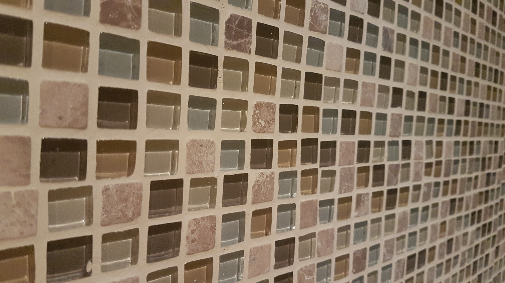
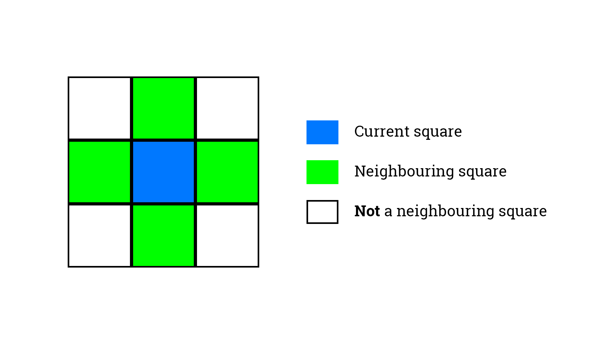

# Kitchen Mosaic | #1

## Metadata

### Time Limit

1000 milliseconds.

### Tags

[DFS](https://csacademy.com/lesson/depth_first_search) | [BFS](https://csacademy.com/lesson/breadth_first_search) | [Graph](https://csacademy.com/lesson/introduction_to_graphs)
-|-|-

## General Statement

It is 5 a.m. and Bill just came back from a huge party his friend organized. He is a bit drunk and hungry, so he decides to eat something. He opens his fridge, takes out a bottle of milk, then he takes a pack of corn flakes from the shelf and, suddenly, freezes. That is fine, many people in such state do that -- dumb staring is very common when you are standing drunk in the middle of your kitchen at 5 o'clock in the morning.

While he was standing like that, staring at space-time fluctuations in his mind, Bill looked at the mosaic on the kitchen walls. He noticed that some of the squares are dark while others are brighter. "Interesting... -- he thought -- If I was to trace this mosaic and present it in a form of a grid where each square is either black or white, what would be the biggest path of squares of the same colour, and how many squares would there be [in this path]?"



He was too tired to do stuff like tracing his kitchen mosaic and testing it on the longest path, so he went to bed. Yet, when he woke up around noon, he remembered his idea, took his old, squared math textbook and traced the mosaic onto one of the pages (he just filled the squares that are supposed to be black).

He looked at the page of his textbook and realised, instantly, that there are too many squares to process by hand. "It is great -- he thought to himself -- that my best friend is a programmer and he knows how to deal with the problems like that! Let me go to him and ask for help!"

Fortunately, *you* are Bill's coder-friend, yet a very kind one, so it is not a big deal for you to sort this out. Is it?

## Input

There will be *N* test cases. For each test case you will be given the *height* (H) and the *width* (W) of a grid. **1 ≤ H, W ≤ 1'000**.

Next *H* lines will contain the grid. *Dot* (.) character represents a white square, *Hash* (#) represents a black one. **Characters are not separated by spaces**.

Input ends with `0 0`.

Input is contained within the *in.txt* file inside the *code* folder. You can make your program read the file or you can `copy + paste` its contents into the console while running your algorithm.

## Task

Scan through the grid, spot the longest path formed by the squares of the same colour and find out how many squares there are in that path.

If you are standing on some square *X*, only the next top, right, bottom, and left squares bordering with *X* are considered its neighbours and can be a part of a path starting with *X*.



## Output

Inside the *code* folder you will find a file named *out.txt* where you must write your answers. First line of *out.txt* must contain a number of **milliseconds** it took your algorithm to compute the solution. Next *N* lines must contain **one** number each -- solution for the *i-th* of the *N* test cases you were given.

**IMPORTANT**: You have to be careful with the way you time your code. You do not want to time the part of your code that asks for input, *escpecially* if you are provide input through the Terminal window instead of reading a file. Make sure to **only** time the part that process the input and produces the result.

## Samples & Explanations

### Sample Input

```txt
4 5
..##.
.##..
...##
.#.#.
2 2
..
..
3 2
##
##
##
10 10
....#...#.
..##.#...#
.#...####.
.##..#####
#..#.####.
#..#...#..
##...####.
..#....##.
#.########
#.....##..
0 0
```

### Sample Output

```txt
8
4
6
32
```

### Explanation

In the **first test case**, 8 dots at positions **(0, 0) (0, 1) (1, 0) (2, 0) (2, 1) (2, 2) (3, 0) (3, 2)** form the longest single-coloured path.

In the **second** test case, the whole grid has white squares *only*, so the longest path is simply the number of squares in a grid.

The same is true for the black squares in the **third** test case.