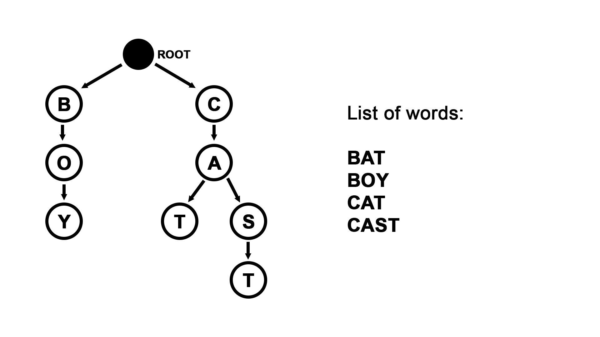

# Explanation | #3

In the [problem #1](../../1.%20kitchen%20mosaic/task.md) we have already seen data presented in a table. To solve the problem we used DFS. This time, even though it is a grid, we are not going to use DFS on it. Yet, DFS is going to be used in my solution -- you will see why in a second.

Let us, first of all, analyze the problem. What would be the hard bit? Another important question to ask is "What part is going to take too much time if done naively (using brute force)?"

Well, we know that words can **only** go in two directions:

1. left to right
2. top to bottom

We also know that two words **cannot** start at the same square (letter). This means that when we are exploring the grid, for every square we only need to go right and bottom *once* to see if we can find any word(s) that start(s) at that square. This means that we do not really need DFS to explore the grid -- it is quite linear in this case -- just go letter by letter.

The real challenge is that there may be many words in the list given to you and if you will be exploring the whole grid again and again for every single one of them, time limit will be exceeded. This naïve approach is too long -- we need a way to solve this faster.

Usually, data structures are very helpful when in need of performance improvements. The very first thought may be to simply store words in a set. This will -- in theory -- give you roughly speaking O(log n) complexity, however, there is a small nuance to it...

Let's imagine that -- in our grid -- we have a line like this:

```txt
CAKCIRCLECURD
0123456789...   <-- indices
```

We can easily spot the word CIRCLE in the middle there. CIRLCLE is, indeed, contained in a word list we were given. Suppose, we were checking the grid, letter by letter, and now we are on this line, at position 3 (at the position of the first letter of CIRCLE). CIRCLE is stored in some `set<string> W`. We also declare `string S = ""` where we are going to store the word. First of all, we add letter C (from our current position) into `S`, then we ask `W` if it contains any string `S = "C"`. The answer is 'no', and we move on to the next letter and repeat this same routine.

```cpp
set<string> W = { "CIRCLE" };
string L = "CAKCIRCLECURD";
string S = "";
int id = 3;
while ( id < L.length() )
{
    S += L[id];
    if ( W.count(S) ) cout << S << " found!" << endl;
    else cout << "Bad luck, there's no " << S << endl;
    ++id;
}
```

This would generate output like so:

```terminal
Bad luck, there's no C
Bad luck, there's no CI
Bad luck, there's no CIR
Bad luck, there's no CIRC
Bad luck, there's no CIRCL
CIRCLE found!
```

This is done in O(log n). Pretty good, right? Well... Suppose now our line is:

```txt
QEBWPHMTXTAFU
```

It is obvious that there are no words in it. Let's see what our algorithm is going to do starting at `int id = 0`:

```terminal
Bad luck, there's no Q
Bad luck, there's no QE
Bad luck, there's no QEB
Bad luck, there's no QEBW
Bad luck, there's no QEBWP
Bad luck, there's no QEBWPH
Bad luck, there's no QEBWPHM
Bad luck, there's no QEBWPHMT
Bad luck, there's no QEBWPHMTX
Bad luck, there's no QEBWPHMTXT
Bad luck, there's no QEBWPHMTXTA
Bad luck, there's no QEBWPHMTXTAF
Bad luck, there's no QEBWPHMTXTAFU
```

It will have to go through the whole line to understand that there is not a single word in `W` that starts with Q, then it will try and fail with E, then B, etc. If our line was 1000 symbols long, it would require is roughly 500'000 iterations to know that it does not contain a single word from the dictionary. The formula is:

```cpp
string L = ". . . something . . .";
int len = L.length();   // 1'000
/* for the last char in some line L that does not contain
 * any words from the given dictionary, it will only have
 * to iterate once, twice for the one before it, three times
 * for the third from the end, etc...
 *
 * Total number N of iterations:
 * N = len + (len - 1) + (len - 2) ... 3 + 2 + 1
 */
int N = 0;
for (int i = 1; i <= len; ++i)
    N += i;
// in this case N = 500'500
```

From what we can see, the linear part of this approach makes the use of `set` too inefficient for us. We need a way to know straight away whether we are on the right path or not. We need a data structure that will be able to do this (visual example):

Dictionary:

+ BOW
+ GARAGE
+ GAS
+ KEY
+ LAND
+ LAW

```txt
user input >>> L
```

Words that satisfy:

+ **L**AND
+ **L**AW

```txt
user input >>> LA
```

Words that satisfy:

+ **LA**ND
+ **LA**W

```txt
user input >>> LAW
```

Words that satisfy:

+ **LAW**

In other words we need a data structure that will be able to narrow down the list of words until we either find the word we were looking for, or give it an input that does not satisfy any word at all (in which case we would move on to the next square).

I imagine that this can be achieved with a tree in which on every level *i* we are going to store the `char`s that are located at index *i* of every word from the dictionary. Every char on every level *i* must be connected to some `char` from level *i - 1* -- letter at position *i - 1* in some word; unless *i = 0* -- all the `char`s at this level are connected to the root of the tree that does not contain any letters. This is how this tree would look like:



This tree structure allows us to see straight away whether we are headed in the right direction or not. For example, if our input is going to be like:

```txt
user input >>> K
```

Our tree will politely explain to us that ROOT node does not have a single child with a letter K, therefore, there is not such word in the dictionary -- we know it straight away, from the start, and there is no need to iterate through the whole line (or column).

Yet, if we do

```txt
user input >>> CA
```

The tree will say "fine, give me more" and wait for further input. If we input CAZ, for example, once again we will hear: "I have no such child, bro." But if we give it

```txt
user input >>> CAT
```

the tree will know that a leaf has been reached, therefore, we found CAT! Now, in some cases, we need to recognize words even when we did not reach a leaf of the tree. Let's look at this example:

```cpp
vector<string> W = { "CAT", "CATTLE" };
/* in this case, our tree will look like this:
 *   ROOT --> C --> A --> T --> T --> L --> E
 *           the only leaf in this tree is ^E^
 * nevertheless, CAT is still present.
 * so we need a way to know to still store CAT.
 * To do that, I marked nodes that are last letter
 * of one word and a middle letter of another word
 * with a boolean value isend.
 * Even if the rules say that two words cannot 
 * start at the same position and go in the same
 * direction, we need to store CAT, just in case
 * the following set of letters in not CATTLE,
 * for example if there was a line like CCATTLB
 * and we continued without storing CAT, thinking
 * that there is CATTLE present, it would fool us
 * and we would lose CAT. In my opinion, it is useful
 * here to use set<string> to avoid repetition.
 */
struct Node
{
    int id;
    char letter;
    vector<Node> children;
    bool isend;
};
```

Now, that we have figured this out, we need to implement our `vector< vector<Node> > createTree()` function. Its idea is pretty easy: create an adjacensy table, starting with root, where each `vector<Node>` in `vector< vector<Node> >` contains `Node`s that are its *children*. When it is done, we store this tree and continue with our solution. 

Not much is left to do after that. Go through each cell of the grid, exploring in two directions

1. left to right
2. top to bottom

using our tree to find words (they will always end with some `Node` where `.isend = true`).