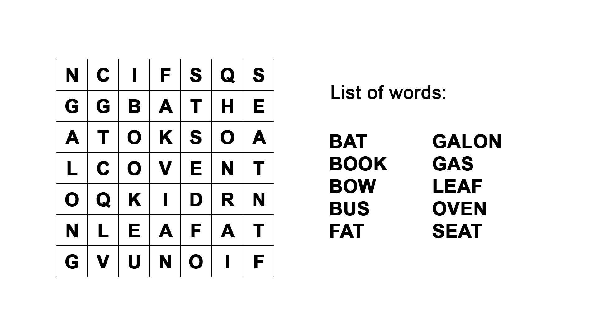

# Buscapalabras | #3

## Metadata

### Time Limit

1000 milliseconds.

### Tags

[DFS](https://csacademy.com/lesson/depth_first_search) | [BFS](https://csacademy.com/lesson/breadth_first_search) | [Graph](https://csacademy.com/lesson/introduction_to_graphs) | [Tree](https://en.wikipedia.org/wiki/Tree_(data_structure))
-|-|-|-

## General Statement

Bill decided to make some "buscapalabra" puzzles. Buscapalabra is a grid that consists of letters (mostly random) with occasional words inserted into it. The point is to find those words and circle them. Each buscapalabra puzzle usually has a list of words that are present in it, but Bill thought it would be too easy to just give them to you like that so, in his list, he wrote more words than there are in a grid.

Do you want to solve his puzzle? I hope so.

## Input

There will be *N* test cases. For each test case, in the first line, you will be given the *number of words in a list* (K) *height* (H) and the *width* (W) of a grid. **1 ≤ H, W ≤ 1'000**.

Next *K* lines will contain one word each (the list of nubmers). After the list, next *H* lines will contain the grid of Bill's buscapalabra puzzle. **Characters are not separated by spaces**.

Input ends with `0 0 0`.

Input is contained within the *in.txt* file inside the *code* folder. You can make your program read the file or you can `copy + paste` its contents into the Terminal while running your algorithm.

## Task

Scan through the grid and find as many words from the list as you can.

**IMPORTANT:** In this buscapalabra puzzle, each word is either horizontal or vertical; if it is horizontal, its direction will be left to right, if it is vertical, it will go top to bottom. Words can share some letters with each other. For example, in the in the grid below, LEAF shears its last letter with FAT (6-th line). Yet, two words **cannot** start from the same letter and go into the same direction (if you have a line like CATTLE, the word encoded can either be CAT or CATTLE -- **not both!**).

For line like

```txt
SRQCATTLELPT
```

dictionary will either hold CAT or CATTLE, **never both**. Yet, input like

```txt
...CATTLE...
...A........
...T........
```

is perfectly fine. In this case, dictionary is legally allowed to hold both CAT and CATTLE at the same time.



## Output

Inside the *code* folder you will find a file named *out.txt* where you must write your answers. First line of *out.txt* must contain a number of **milliseconds** it took your algorithm to compute the solution. For each test case, first line of output must contain the *number of words* (F) you found in the grid. On the next *F* lines, print all those words.

**IMPORTANT**: You have to be careful with the way you time your code. You do not want to time the part of your code that asks for input, *especially* if you provide input through the Terminal window instead of reading a file. Make sure to **only** time the part that processes the input and produces the result.

## Samples & Explanations

### Sample Input

```txt
10 7 7
BAT
BOOK
BOW
BUS
FAT
GALON
GAS
LEAF
OVEN
SEAT
NCIFSQS
GGBATHE
ATOKSOA
LCOVENT
OQKIDRN
NLEAFAT
GVUNOIF
0 0 0
```

### Sample Output

```txt
7
BAT
BOOK
OVEN
SEAT
FAT
GALON
LEAF
```

### Explanation

In the given grid, you can find all the words listed in output. You **cannot** find BOW, BUS, and GAS in this grid (thus, they are not included into the output).

**NOTE:** You can see that the word VENT is also present in the grid, yet, this word is not included into the list given to you and, therefore, is not considered to be a part of the asnwer.
